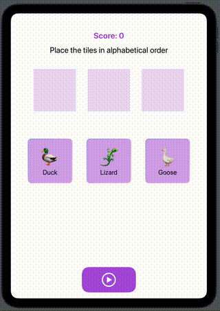

# Observable Objects, Gestures, Rotation Effects 

## Observable Object - Components
- `@Observable`
- `@State private var alphabetizer = Alphabetizer()`
- `.environment(alphabetizer)`
- `@Environment(Alphabetizer.self) private var alphabetizer`

## Gestures

    .gesture(DragGesture().onChanged { value in
      tile.position = value.location
    })
    
    .onTapGesture {
      tile.flipped.toggle()
    }

## Rotation Effects (Flipping)

    .rotation3DEffect(.degrees(tile.flipped ? 180 : 0), axis: (x: 0, y: 1, z: 0))
    .animation(.easeInOut, value: tile.flipped)
    

