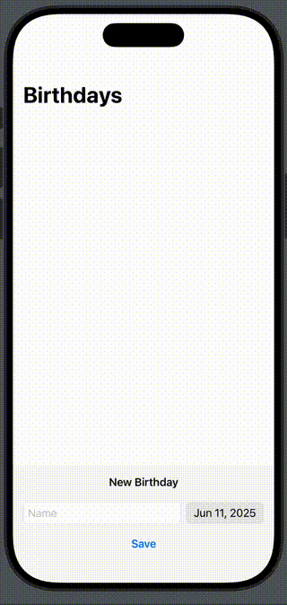

# Persisting Data - SwiftData

## Concepts
- SwiftData
  - @Model 
  - @Query
  - @Environment(\.modelContext) private var context
  - context.insert(<your-model-instance>)
  - .modelContainer(for: <Model>.self, inMemory: true
  - .modelContainer(for: Friend.self)

## Views
- NavigationStack
- DatePicker

## Modifiers
- .navigationTitle
- .safeAreaInset
- .background(.bar)

