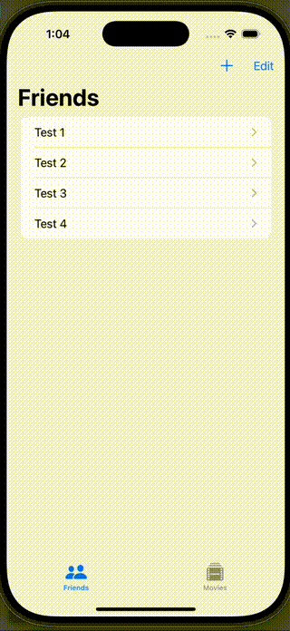
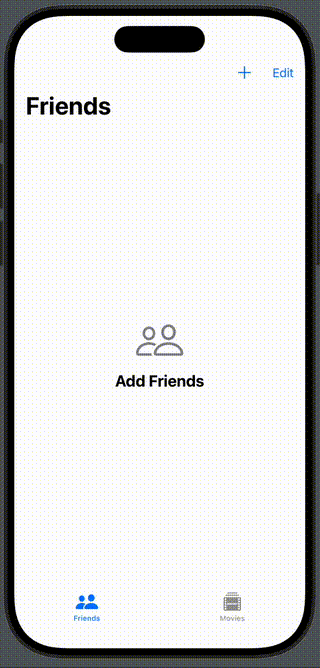

# Data Modeling, CRUD, Associations, Persistence, Test Data

## Swift Data Components
- `@MainAfter`
- `ModelConfiguration`
- `.modelContainer(for: [Friend.self, Movie.self], inMemory: true)`
- `.modelContainer(SampleData.shared.modelContainer)`
- `@Query(sort: \Friend.name) private var friends: [Friend]`
- `@Environment(\.modelContext) private var context`
- `@Bindable var friend: Friend`

## Search Form / Searching
- `.searchable(text: $searchText)`
- `#Predicate<Movie>`

      let predicate = #Predicate<Movie> { movie in
        titleFilter.isEmpty || movie.title.localizedStandardContains(titleFilter)
      }

## CRUD - related
- `.toolbar`
  - `ToolbarItem`
  - `.sheet`
  - `.interactiveDismissDisabled`
 
## Tabs
- `TabView`
- `Tab`

## Navigating
- `NavigationSplitView`
- `NavigationLink`
- `NavigationStack`
- `.navigationTitle`
- `.navigationBarTitleDisplayMode(.inline)`

## New Form
- `Form`
- `TextField`
- `Picker`
- `DatePicker`

## Layout-Related
- `Group`
- `Section`

## Start Phase of Project

## Final Phase of Project

