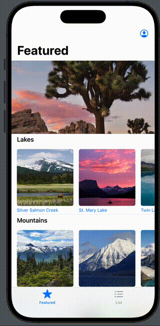

# An App with an Overall complete Design.

## Structure Breakdown
This application is large enough where it requires some structure. 
We already know to break our App up into these two directories:
- Model
- Views

### Views 
- We keep the `ContentView` at the top. 
- We break the Other views down by **feature**. 
  - `Landmarks` (because there is a `list`, `row`, and `detail` view)
  - `Categories` (becuase there is a `home`, `row`, and `item` view)
  - `Profiles` (This is a toolbar item but a complete section with `Host`, `Summary`, and `Editor`)
  - `Helper` (These are shared views between all the other views)

## Major Feature Highlights
- `MapKit` and `CoreLocation` in order to plot coordinates on a map
- Load in JSON data into a model 
  - For loading requirement is that model conforms to `decodable`
  - For both loading and saving, model must conform to `codable`
- Have a collection broken up into a dictionary, where the key is the category, and display the items in each category in a horizontal, scrollview. 
- Filter a list by a very simple form (a toggle) at the top
- User profile in toolbar that is updatable.
- Some animation

## Going Further...
This app stops there, but the tutorial goes on to show additional features of development:
- Incorporating UI Kit (I didn't care for the feature much: a way to change photos in place like a carousel, with dots indicating the amount of slides for the spot)
- Creating a `target` for watchOS and macOS.
  - Share files between targets for each file by highlighting them, going to file inspector, and adding to **Target Membership**
- Macro conditionals for how to build the view hierarchy per device
 - `#if !os(watchOS)`
 - `#if os(macOS)`
    

