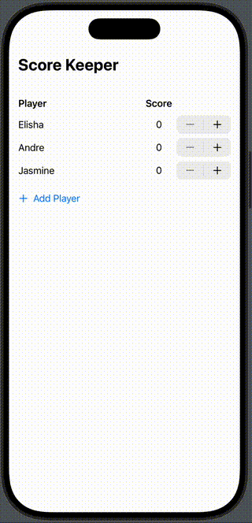

# Modeling Data and Grids

## Concepts
- Unit Tests (add via Target)
  - @testable
  - @Test
  - #expect
- Modeling Data
- Manually conform to Equatable for a Struct
- Looping over, and mutating an array of structs (hint: use index)
- @Binding
- @Previewable

## Views
- Grid
- GridRow  
- Stepper
- Picker

## Modifiers
- .gridColumnAlignment
- .opacity
- .disabled

## Version 1

## Version 2

