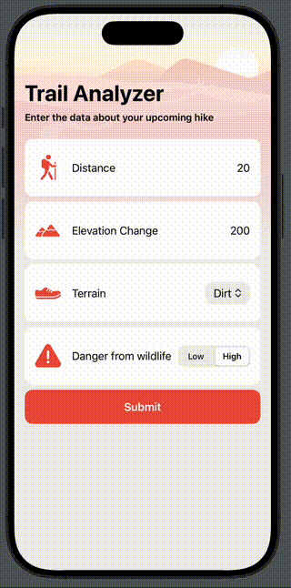

# Machine Learning Project

This project first required the process of creating a model  with the Create ML xcode tool. 

Once the model was created, we can use it in the app. 

This app passes the user-entered input as arguments into the model that we trained, and it outputs the predicted risk rating.

## Imports
- `import CoreML`
- `MLModelConfiguration()` 
- `let predictedRisk = try model.prediction(input: input).risk`

## Views
- NavigationStack
  - NavigationLink
- ScrollView

## Modifiers
- .onAppear
- .navigationTitle("Results")
- .navigationBarTitleDisplayMode(.large)
- .toolbar

## Creating a custom modifier
You can look at the code (TrailTheme) and follow the pattern. It is basically a view with a content parameter: you define what you want in the body function just like any other view, but then you wrap the content parameter inside of it. Then you extend the view with `modifier`

## Misc
We use `@Previewable` when we want to pass in a binding into a `#Preview`

